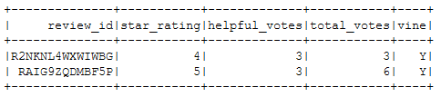
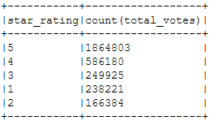
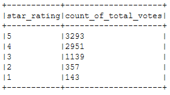
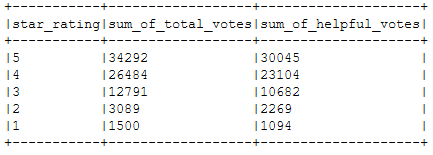
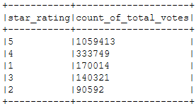
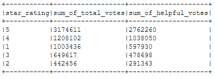

# Big Data ETL and Product Review Analysis with AWS

## Objective
* Complete ETL on Books and Camera AWS-S3 datasets. 
* Analyze vine and non-vine customer reviews to see if vine members are more trusworthy.

## About Amazon Vine, Datasets, and Programs Used
About Amazon Vine: [Vine Program](https://www.amazon.com/gp/vine/help?ie=UTF8)
Dataset: [Customer Review Dataset List](https://s3.amazonaws.com/amazon-reviews-pds/tsv/index.txt)
Tools & Languages: Pyspark, AWS-RDS, AWS-S3, PosgreSQL, GoogleColab, Jupyter Notebook

## How to Use
* Created database instance in AWS-RDS.
* Created server on postgres, database, and table from schema.
* Created GoogleColab notebook and imported the customer review dataset url of choice.
* Complete ETL on dataframes to match schema.
* Load the 

## Results
The customer reviews from the Books and Camera datasets were split into vine and non-vine customers in order to see how they vote. Based on the findings below, it wasn't very clear if vine members were more or less trustworthy than non-vine members. There were less vine members for both of the datasets which is understandable since the Vine Program is invite-only. More information will be needed to compare how customers voted before and after joining vine because honestly, what's going to stop someone from anonymous giving their thoughts?

--

### [Books Analysis](BigDataAWS_Books1.ipynb)
One of the books datasets was chosen to see how customers voted on their purchase.

As shown above, there's only two vine members who voted out of over 3 million total customers in this review. They didn't give anything lower than a four-star rating and a handful of votes and helpful votes. However, this wasn't enough members to see if their reviews are trustworthy.

From the 3,105,513 non-vine members who reviewed their purchases, over a million people gave a five-star review. Four and three-star ratings followed after which could mean that the majority of people were pleased by their purchase.

--

### [Camera Analysis](BigDataAWS_Camera.ipynb)
There were more vine users rating cameras as opposed to books with a total of 7,883 people.

The majority of the vine votes were five and four-star rating(6,244 votes) whereas the total votes in the one to three-star rating was 1,639.

There wasn't a huge gap between the sum of total and helpful votes.

The two dataframes above also show a high number of four and five-star reviews which further emphasizes that people seem pretty satisfied with their purchase.

- - -

#### Copyright

Trilogy Education Services © 2019. All Rights Reserved.
